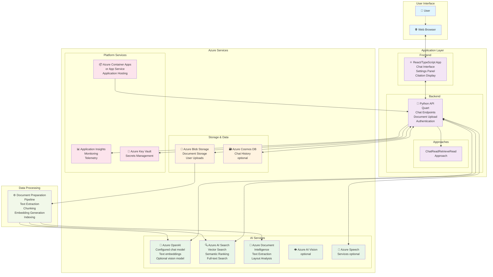
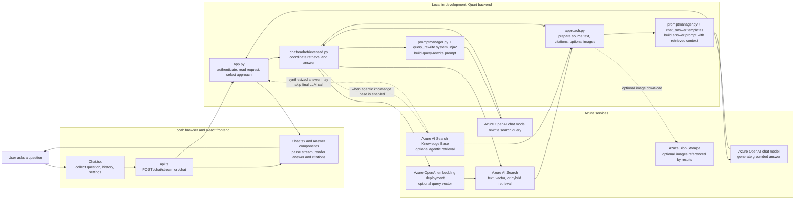

# RAG Chat: Application Architecture

This document provides a detailed architectural overview of this application, a Retrieval Augmented Generation (RAG) application that creates a ChatGPT-like experience over your own documents. It combines Azure OpenAI Service for AI capabilities with Azure AI Search for document indexing and retrieval.

For getting started with the application, see the main [README](../README.md).

## Architecture Diagram

The following diagram illustrates the complete architecture including user interaction flow, application components, and Azure services:

## Chat Request: Default RAG Flow

In local development, the browser, React frontend, and Quart backend run on your computer. The default model, embeddings, and search are still remote Azure services; running the app locally does not mean the LLM or search index runs locally. When deployed, the same backend code runs in Azure Container Apps or App Service instead. The exact model and endpoints come from the environment configuration.

| Step | Code / resource | Where it runs | What happens |
| --- | --- | --- | --- |
| 1. Build the request | [Chat.tsx](../app/frontend/src/pages/chat/Chat.tsx) | Browser | Combines the new question with prior turns, developer settings, and optional session state. |
| 2. Send the request | [api.ts](../app/frontend/src/api/api.ts) | Browser | Calls `/chat/stream` by default, or `/chat` when streaming is disabled. |
| 3. Enter the backend | [app.py](../app/backend/app.py) | Local Quart during development; Azure host after deployment | Authenticates the request, creates/reuses session state, and forwards messages to the configured chat approach. |
| 4. Rewrite the question | [chatreadretrieveread.py](../app/backend/approaches/chatreadretrieveread.py), [approach.py](../app/backend/approaches/approach.py), [query_rewrite.system.jinja2](../app/backend/approaches/prompts/query_rewrite.system.jinja2) | Prompt construction is local; inference uses the configured OpenAI service, Azure OpenAI by default | Uses the current question and conversation history to make a focused search query. If rewriting yields no usable query, it falls back to the user's question. |
| 5. Create a query vector | [approach.py](../app/backend/approaches/approach.py) | Backend code is local/deployed; embedding inference is remote | When vector retrieval is enabled, sends the rewritten query to the embedding deployment. Text-only retrieval skips this call. |
| 6. Retrieve matching chunks | [approach.py](../app/backend/approaches/approach.py) | Azure AI Search | Searches the configured index using text, vectors, or both; optional filters and semantic ranking can further refine results. Returns the top matching chunks and source metadata. |
| 7. Assemble evidence | [approach.py](../app/backend/approaches/approach.py) | Backend code is local/deployed; optional image bytes come from Azure Blob Storage | Selects retrieved text/captions, creates citations, and optionally downloads image content for multimodal answers. |
| 8. Generate the answer | [chatreadretrieveread.py](../app/backend/approaches/chatreadretrieveread.py), [chat_answer.system.jinja2](../app/backend/approaches/prompts/chat_answer.system.jinja2), [chat_answer.user.jinja2](../app/backend/approaches/prompts/chat_answer.user.jinja2) | Prompt construction is local; answer generation uses the configured chat model | Combines the original question, conversation history, retrieved evidence, and citation instructions. The LLM generates an answer grounded in that context. |
| 9. Stream and display | [app.py](../app/backend/app.py), [Chat.tsx](../app/frontend/src/pages/chat/Chat.tsx), [Answer.tsx](../app/frontend/src/components/Answer/Answer.tsx) | Quart and browser | Quart serializes response events as NDJSON; the frontend parses them and displays the answer, sources, and optional follow-up questions. |

**Optional retrieval mode:** when `use_agentic_knowledgebase` is enabled, `chatreadretrieveread.py` calls an Azure AI Search Knowledge Base instead of the regular rewrite, embedding, and search sequence. Depending on the configured knowledge sources, retrieval can include web or SharePoint. If that retrieval returns a synthesized answer, the usual final chat-completion call is skipped. Chat history is stored in browser IndexedDB or Azure Cosmos DB only when the corresponding history option is enabled.

## Document Ingestion: How Search Data Is Prepared

Ingestion has a separate path from chat. The prep script and parsing/chunking code run on your computer in the manual mode, but the default embeddings and the final search index are Azure services. Cloud ingestion moves orchestration and custom processing into Azure Functions and an Azure AI Search indexer.

```mermaid
flowchart TD
    subgraph Manual["Manual ingestion: local script + Azure services"]
        Files[Local data files]
        Prep[prepdocs.py<br/>select ingestion strategy]
        Strategy[FileStrategy / FileProcessor<br/>parse and process each file]
        Parser[Local parsers or Azure Document Intelligence<br/>extract page text and layout]
        Chunk[textsplitter.py<br/>split text into search chunks]
        DocEmbed[Azure OpenAI embeddings<br/>optional vectors for chunks]
        Upload[Azure Blob Storage<br/>store original documents and optional figures]
        Index[Azure AI Search<br/>store searchable chunks and metadata]
        Files --> Prep --> Strategy
        Strategy --> Upload
        Strategy --> Parser --> Chunk
        Chunk --> DocEmbed --> Index
        Chunk --> Index
    end
    subgraph Cloud["Optional cloud ingestion: Azure-managed processing"]
        BlobInput[Azure Blob Storage<br/>source documents]
        Indexer[Azure AI Search indexer<br/>orchestrate schedule and enrichment]
        Extract[document_extractor Function<br/>extract text and figure metadata]
        Figure[figure_processor Function<br/>optional figure descriptions and vectors]
        Shape[Azure AI Search Shaper skill<br/>combine document and figure data]
        Text[text_processor Function<br/>merge figures, chunk, embed]
        CloudIndex[Azure AI Search index<br/>processed chunks]
        BlobInput --> Indexer --> Extract --> Figure --> Shape --> Text --> CloudIndex
    end
```

| Step | Code / resource | Where it runs | What happens |
| --- | --- | --- | --- |
| 1. Start manual ingestion | [prepdocs.ps1](../scripts/prepdocs.ps1), [prepdocs.py](../app/backend/prepdocs.py) | Local machine | Loads the configured environment, finds files under `data/` (or the supplied path), and selects the configured strategy. |
| 2. Read and parse files | [filestrategy.py](../app/backend/prepdocslib/filestrategy.py), [fileprocessor.py](../app/backend/prepdocslib/fileprocessor.py), [parser.py](../app/backend/prepdocslib/parser.py) and format-specific parsers | Local machine, with optional Azure Document Intelligence calls | Chooses a parser by file type. Text, JSON, and CSV use local parsers; supported complex formats can use Document Intelligence unless local parser options are selected. |
| 3. Process figures, when enabled | [figureprocessor.py](../app/backend/prepdocslib/figureprocessor.py), [mediadescriber.py](../app/backend/prepdocslib/mediadescriber.py) | Local orchestration plus configured Azure AI model/service | Crops figure images and can describe them with a vision model or Content Understanding; image embeddings are optional. Figure images may be uploaded to Blob Storage. |
| 4. Split into chunks | [textsplitter.py](../app/backend/prepdocslib/textsplitter.py), [textprocessor.py](../app/backend/prepdocslib/textprocessor.py) | Local machine in manual mode; Azure Function in cloud mode | Builds smaller, overlapping text chunks so retrieval can send only relevant passages to the LLM. Figure descriptions are merged into text when multimodal ingestion is enabled. |
| 5. Embed and index | [embeddings.py](../app/backend/prepdocslib/embeddings.py), [searchmanager.py](../app/backend/prepdocslib/searchmanager.py) | Embedding inference and index are Azure services by default | Generates vectors when vector search is enabled, then writes each chunk, its vector, and source metadata to Azure AI Search. Original files and optional images are stored in Azure Blob Storage. |
| 6. Run cloud ingestion, if configured | [setup_cloud_ingestion.py](../app/backend/setup_cloud_ingestion.py), [document_extractor](../app/functions/document_extractor), [figure_processor](../app/functions/figure_processor), [text_processor](../app/functions/text_processor) | Azure AI Search indexer, built-in Shaper skill, and Azure Functions | The indexer reads Blob documents and coordinates custom skills. Functions extract content, optionally enrich figures, merge/chunk text, and return records for the Azure AI Search index. |

**What is stored for chat:** ingestion puts chunk text, source/page identifiers, optional vectors, and optional image references in the search index. At question time, the app retrieves only matching chunks and passes that evidence to the chat model; it does not normally send the entire document collection to the LLM.

## Key Components

### Frontend (React/TypeScript)

- **Chat Interface**: Main conversational UI
- **Settings Panel**: Configuration options for AI behavior
- **Citation Display**: Shows sources and references
- **Authentication**: Optional user login integration

### Backend (Python)

- **API Layer**: RESTful endpoints for chat, search, and configuration. See [HTTP Protocol](http_protocol.md) for detailed API documentation.
- **Approach Patterns**: Different strategies for processing queries
  - `ChatReadRetrieveRead`: Multi-turn conversation with retrieval
- **Authentication**: Optional integration with Azure Active Directory

### Azure Services Integration

- **Azure OpenAI**: Powers the conversational AI capabilities
- **Azure AI Search**: Provides semantic and vector search over documents
- **Azure Blob Storage**: Stores original documents and processed content
- **Application Insights**: Provides monitoring and telemetry

## Optional Features

The architecture supports several optional features that can be enabled. For detailed configuration instructions, see the [optional features guide](deploy_features.md):

- **GPT-4 with Vision**: Process image-heavy documents
- **Speech Services**: Voice input/output capabilities
- **Chat History**: Persistent conversation storage in Cosmos DB
- **Authentication**: User login and access control
- **Private Endpoints**: Network isolation for enhanced security

## Deployment Options

The application can be deployed using:

- **Azure Container Apps** (default): Serverless container hosting
- **Azure App Service**: Traditional PaaS hosting option. See the [App Service hosting guide](appservice.md) for detailed instructions.

Both options support the same feature set and can be configured through the Azure Developer CLI (azd).
